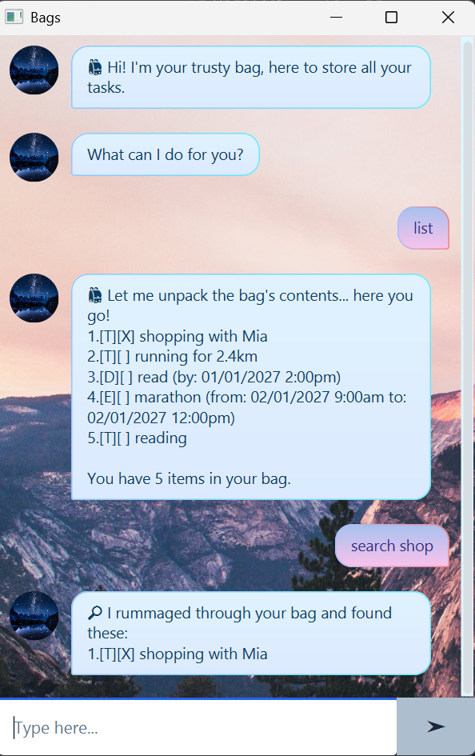

# Bags User Guide

**Bags** is a chatbot that helps you keep track of to-do tasks, deadlines,
and events.



## Quick Start

1. Install JDK 25 or later.
2. Download `bags.jar` from the [latest release](https://github.com/clairep246/ip/releases/latest).
3. Put `bags.jar` in the folder where you want Bags to store its data.
4. Open a terminal in that folder and run:

   ```
   java -jar bags.jar
   ```

5. Wait for the Bags window to appear. If it does not start, confirm that
   `bags.jar` is in the current folder and rerun the command.
6. Enter a command and press <kbd>Enter</kbd> or click **Send**.
7. Try these commands first:

   ```
   add task
   todo read the user guide
   exit
   list
   ```

## Understanding Bags

This session shows your active tasks. Enter commands at the bottom of the
window; Bags replies in the conversation area.

### Command notation

This guide uses the following notation:

- `<description>` represents a value that you enter.
- `<task number>` represents the displayed number of a task.
- Enter each command on one line.
- Commands and markers such as `/by`, `/from`, and `/to` are case-sensitive.
- Dates and times use the `YYYY-MM-DD HH:MM` format.

For example, in `deadline <description> /by <YYYY-MM-DD HH:MM>`, replace the
items in angle brackets with your own values, but type `deadline` and `/by`
exactly as shown.

### Task types and statuses

Tasks show a number, type, status, and description. Dated tasks also show
their date and time. For example:

`2.[D][X] submit report (by: 15/10/2026 6:00PM)`

| Symbol | Meaning |
| --- | --- |
| `2.` | The task number used by commands such as `mark` and `delete`. |
| `[T]` | To-do task. |
| `[D]` | Deadline task. |
| `[E]` | Event task. |
| `[ ]` | Incomplete task. |
| `[X]` | Completed task. |


## Features

### Adding tasks

Enter `add task` to start task-entry mode. Enter `exit` to leave task-entry mode. Follow the format closely.

| Type of task                                                          | Purpose                                  |
|-----------------------------------------------------------------------|------------------------------------------|
| `todo <description>`                                                  | Add a to-do while in task-entry mode.    |
| `deadline <description> /by <YYYY-MM-DD HH:MM>`                       | Add a deadline while in task-entry mode. |
| `event <description> /from <YYYY-MM-DD HH:MM> /to <YYYY-MM-DD HH:MM>` | Add an event while in task-entry mode.   |

### Listing tasks: `list`

Use this command to display all saved tasks.

### Marking a task as done: `mark <task number>`

Use this command to mark a task as completed.

### Marking a task as not done: `unmark <task number>`

Use this command to mark a completed task as incomplete again.

### Editing a task: `edit <task number>`

Enter `edit <task number>` to enter editing mode. Replace the selected task with a task of the same type, using
the same formats shown in [Adding tasks](#adding-tasks). Enter `exit` instead of a replacement to cancel the edit.

### Finding tasks: `search <keyword>`

Use this command to find tasks whose descriptions contain a keyword. The search is not case-sensitive.


### Deleting a task: `delete <task number>`

Use this command to permanently remove a task from the list.

### Echo mode: `echo`

Enter `echo` to make Bags repeat each message you enter. Enter `exit` to leave echo mode.

### Saving and ending the session: `bye`

Use this command to save your tasks and end the session.

## Command Summary

| Command                                                               | Purpose                                   |
|-----------------------------------------------------------------------|-------------------------------------------|
| `add task`                                                            | Start task-entry mode.                    |
| `todo <description>`                                                  | Add a to-do while in task-entry mode.     |
| `deadline <description> /by <YYYY-MM-DD HH:MM>`                       | Add a deadline while in task-entry mode.  |
| `event <description> /from <YYYY-MM-DD HH:MM> /to <YYYY-MM-DD HH:MM>` | Add an event while in task-entry mode.    |
| `list`                                                                | Display all tasks.                        |
| `mark <task number>`                                                  | Mark a task as done.                      |
| `unmark <task number>`                                                | Mark a task as not done.                  |
| `edit <task number>`                                                  | Replace a task with one of the same type. |
| `search <keyword>`                                                    | Find tasks by description.                |
| `delete <task number>`                                                | Delete a task.                            |
| `echo`                                                                | Start echo mode.                          |
| `exit`                                                                | Leave task-entry, edit, or echo mode.     |
| `bye`                                                                 | Save tasks and end the session.           |
